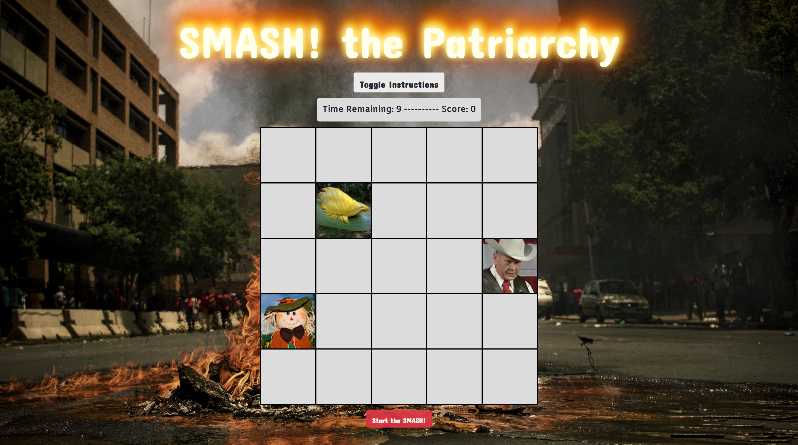
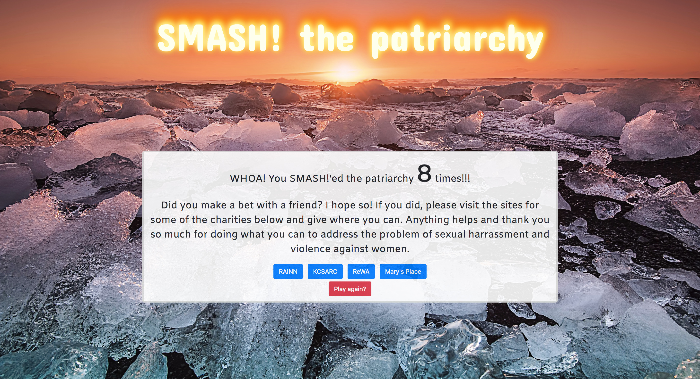

# SMASH! the Patriarchy

SMASH! the Patriarchy is a mobile friendly "game" with a message. The goal is to boost the voices of the courageous women of the #metoo movement while raising money for local & national charities that serve victims of sexual harassment & abuse.

### Deployed here: http://smash-the-patriarchy.surge.sh/
#### GitHub repository: https://github.com/ccawley/SMASH-the-Patriarchy

## Features
- Splash page with a brief background on the #metoo movement.
- Main page with a whack-a-mole style "game."
- Scoring page with links to several charities and an encouragement to donate.

## Technologies
#### Frontend
- HTML5
- CSS3
- JavaScript
- jQuery
- Bootstrap

## Screenshots

### Splash page:

### Main game page:

### Donation & scoring page:

